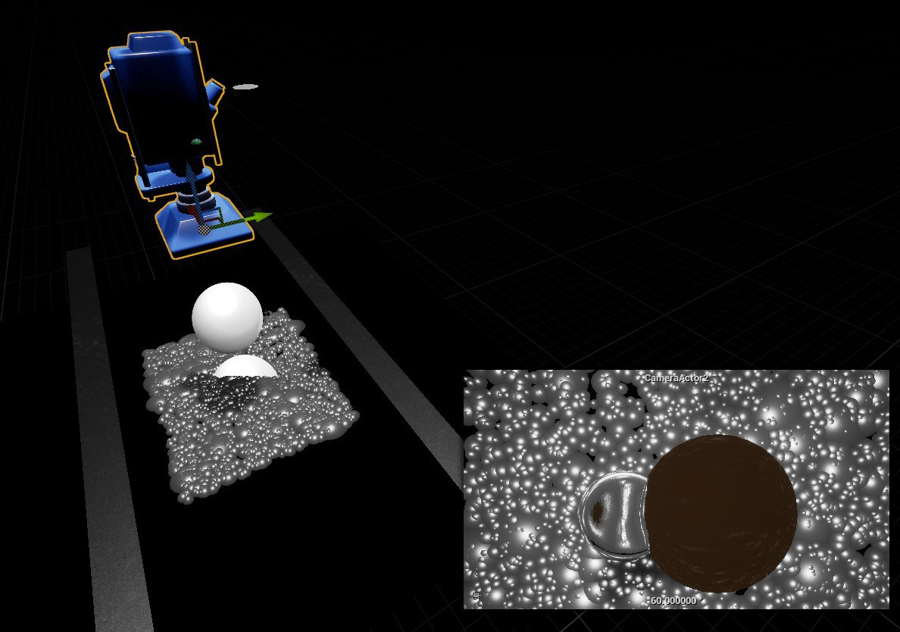
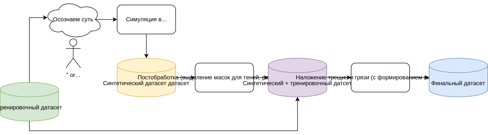
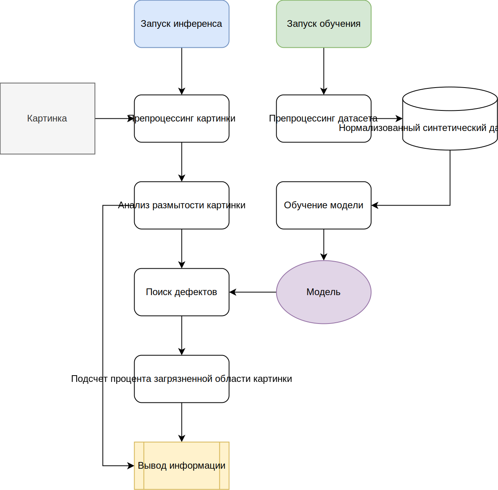
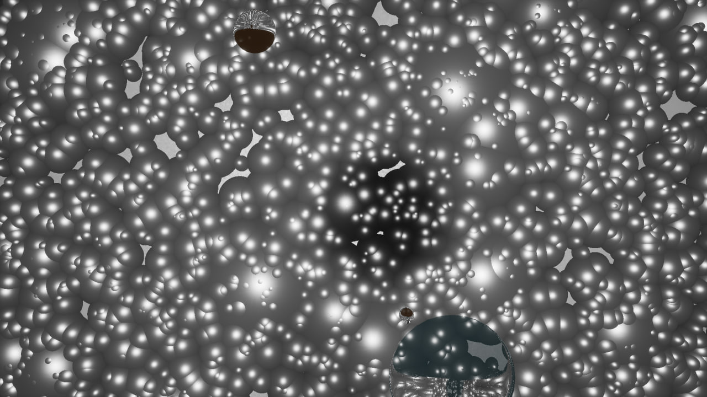
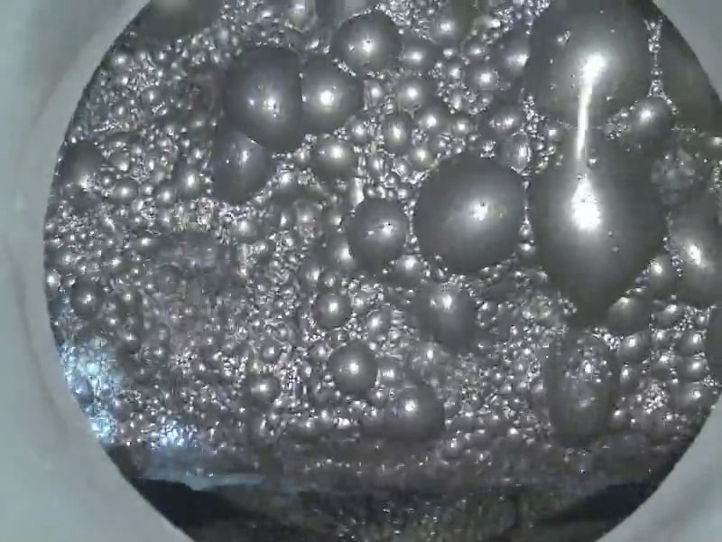

# Система определения загрязнений на кадрах с камер
## <div align="center">Описание</div>
Мы представляем решение для обнаружения загрязнений на линзах камер по изображениям с этих камер. Для этого нами была обучена нейронная сеть семейства YOLOv11 для сегментации, которая способна обнаруживать: Грязь, Капли на линзе, Царапины, Тени. На основе обнаруженных помех, вычисляется процент "загрязнения" обзора камеры. 



Для обучения модели была разработана симуляция в Unreal Engine 4, которая моделирует производственный процесс, добавляя при этом капли на линзу камеры и тени в случайных местах и случайных размеров. Благодаря симуляции удалось расширить датасет с реальными данными, данными синтетическими. 

Технологический стэк: Python, YOLOv11, OpenCV. 

Скачать видео демонстрацию и симулятор (для запуска необходимо установить Unreal Engine 4.27 и загрузить файлы из архива в новый проект): https://disk.yandex.ru/d/HT4YQbpgeTYE3g
Ознакомиться с некоторыми из Blueprints не скачивая можно по ссылкам в разделе ниже.


## <div align="center">Формирование датасета для обучения</div>
  

После генерации изображений в Unreal Engine 4, изображения дополнительно обрабатываются:
1) Размываются области с каплями, что придает больше сходства с реальными изображениями;
2) Извлекаются маски теней для обучения сегментации теней на изображениях.

Полученные изображения также дополнительно аугментируются, путем добавления на них изображений грязи и царапин с соответствующими масками. Итоговый датасет состоит из цветной картинки, имитирующей изображение с камеры и набора масок для разных классов помех.


## <div align="center">Архитектура решения</div>
  

Помимо нейронной сети в систему также интегрирован классификатор нечетких изображений. Это позволяет сразу отсеять изображения содержащие большое количество загрязнений и не отправлять их на обработку нейронной сетью, что экономит ресурсы и время.

Все полезные функции лежат в файле `utils.py`.


## <div align="center">Установка виртуальной среды</div>
## Python
```bash
pyenv install --list
pyenv install 3.10.15
pyenv versions
pyenv local 3.10.15
```

## Venv + Requirements
```bash
python -m venv .hack_env
source .hack_env/bin/activate
python -m pip install --upgrade pip

pip install -r requirements.txt
```

## <div align="center">Запуск</div>
## Обучение 

Запуск обучения:
```bash
python train.py
```

## Инференс 

Запуск инференса:
```bash
python inference.py
```

## <div align="center">Образцы из датасета</div>
### Синтетическое изображение


### Реальное изображение



## <div align="center">Фрагменты Blueprints симуляции в Unreal Engine 4</div>
### Запуск генерации датасета
https://blueprintue.com/blueprint/gkabzay3/

### Создание капелек и теней
https://blueprintue.com/blueprint/vemccim5/

### Создание пенной флотации
https://blueprintue.com/blueprint/i8qcsfvu/

## <div align="center">Лицензия</div>
```
MIT License

Copyright (c) 2024 " or ""="

Permission is hereby granted, free of charge, to any person obtaining a copy
of this software and associated documentation files (the "Software"), to deal
in the Software without restriction, including without limitation the rights
to use, copy, modify, merge, publish, distribute, sublicense, and/or sell
copies of the Software, and to permit persons to whom the Software is
furnished to do so, subject to the following conditions:

The above copyright notice and this permission notice shall be included in all
copies or substantial portions of the Software.

THE SOFTWARE IS PROVIDED "AS IS", WITHOUT WARRANTY OF ANY KIND, EXPRESS OR
IMPLIED, INCLUDING BUT NOT LIMITED TO THE WARRANTIES OF MERCHANTABILITY,
FITNESS FOR A PARTICULAR PURPOSE AND NONINFRINGEMENT. IN NO EVENT SHALL THE
AUTHORS OR COPYRIGHT HOLDERS BE LIABLE FOR ANY CLAIM, DAMAGES OR OTHER
LIABILITY, WHETHER IN AN ACTION OF CONTRACT, TORT OR OTHERWISE, ARISING FROM,
OUT OF OR IN CONNECTION WITH THE SOFTWARE OR THE USE OR OTHER DEALINGS IN THE
SOFTWARE.
```